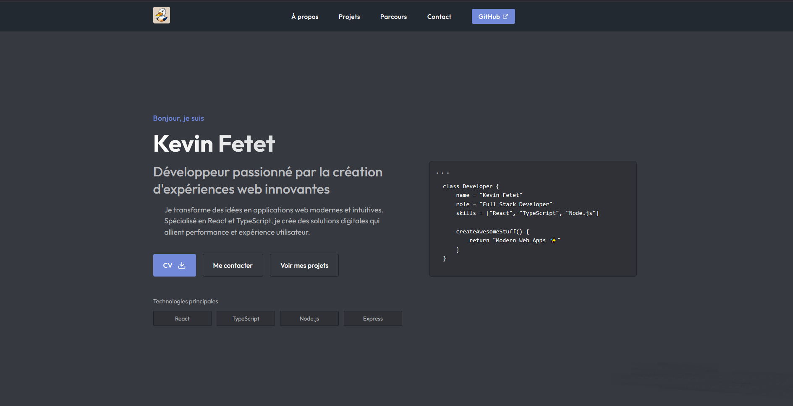

# Kevin Fetet - Portfolio Website

A modern, responsive portfolio website showcasing my work as a Full Stack Developer. Built with clean, semantic HTML5 and modern CSS3 practices.



## 🚀 Features

-   **Responsive Design**: Fully responsive layout that works seamlessly across all devices
-   **Modern UI**: Clean and professional design with smooth animations and transitions
-   **Dark Theme**: Eye-friendly dark theme with carefully chosen color palette
-   **Project Showcase**: Interactive grid layout featuring my latest projects
-   **Skills Section**: Visual representation of technical skills and competencies
-   **Contact Form**: Integrated contact form for easy communication
-   **Performance**: Optimized for fast loading and smooth performance

## 💻 Technologies Used

-   HTML5
-   CSS3
-   JavaScript
-   Google Fonts (Outfit)
-   Devicon for tech stack icons

## 🛠️ Project Structure

```
portfolio/
│
├── index.html        # Main HTML file
├── style.css         # Main stylesheet
├── app.js            # Main JavaScript file
├── mail.js           # Contact form handling
│
├── favicon/          # Favicon and logo files
│   └── ...
│
├── projects/         # Project screenshots
│   └── ...
│
└── cv/              # CV files
    └── CV.pdf
```

## 🎨 Color Palette

```css
--primary: #7289da
--primary-dark: #5b6eae
--secondary: #40444b
--accent: #2f3136
--background: #36393f
--surface: #2f3136
--text: #ffffff
--text-light: #b9bbbe
--border: #202225
```

## 📱 Responsive Breakpoints

-   Desktop: 1200px and above
-   Tablet: 968px to 1199px
-   Mobile: 768px and below
-   Small devices: 480px and below

## 🚀 Getting Started

1. Clone the repository:

```bash
git clone https://github.com/Checkem123/Portoflio-123
```

2. Open `index.html` in your browser to view the website

3. To make changes:
    - Edit `index.html` for content changes
    - Modify `style.css` for styling changes
    - Update `app.js` for functionality changes

## 📄 License

This project is open source and available under the [MIT License](LICENSE).

## 📞 Contact

Feel free to reach out if you have any questions or would like to connect:

-   GitHub: [@Checkem123](https://github.com/Checkem123)
-   Portfolio: [View Live Site](https://fk-portfolio-123.netlify.app/)

---

Made with ❤️ by Kevin Fetet
